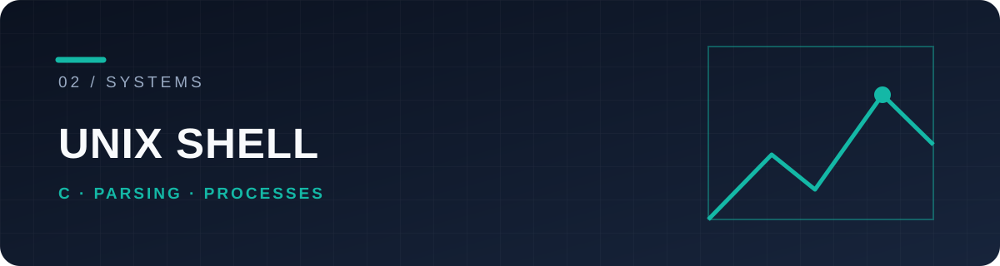

# minishell

A small Unix shell in C, built for the 42 curriculum with a teammate. It turns a command line into processes, pipes and file-descriptor operations.

## What it handles

| Input | Execution |
| --- | --- |
| Single and double quotes, `$VAR`, `$?` | PATH lookup and external commands |
| `<`, `>`, `>>`, `<<` | Redirections and here-documents |
| `|` pipelines | Forking, pipes, waits and exit status |
| `echo`, `cd`, `pwd`, `export`, `unset`, `env`, `exit` | Built-ins in the appropriate process context |

```text
input → tokens → expansion / parsing → command plan → fork / redirect / exec
```

The code separates these stages under [`src/`](src) and shared definitions under [`include/`](include). Signal handling covers interactive interruption and child processes.

## Try it

Requires a Unix-like environment, C compiler, Make and the readline development library.

```sh
make
./minishell
```

Inside the shell:

```sh
echo "Hello, 42 Vienna"
printf 'one\ntwo\n' | grep two > result.txt
cat < result.txt
echo $?
```

Run `make clean` for objects or `make fclean` for objects and executable.

## Scope

This is a learning shell implementing the specified 42 behaviors, not a replacement for Bash. The interesting engineering work is the boundary between parsing, expansion, descriptor ownership, child processes and cleanup. [License](LICENSE).
